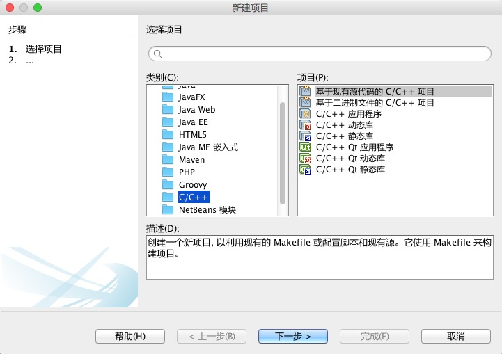
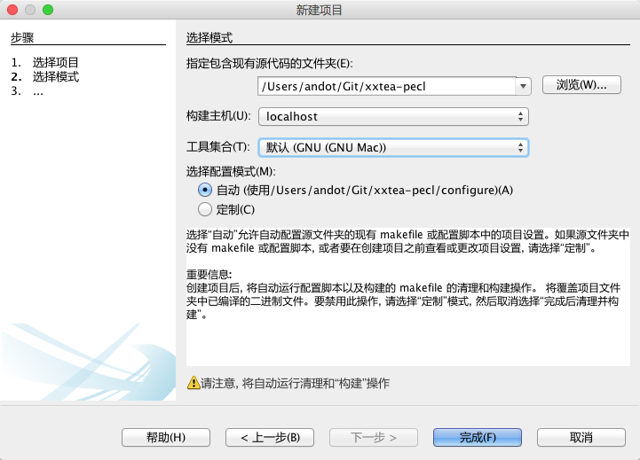
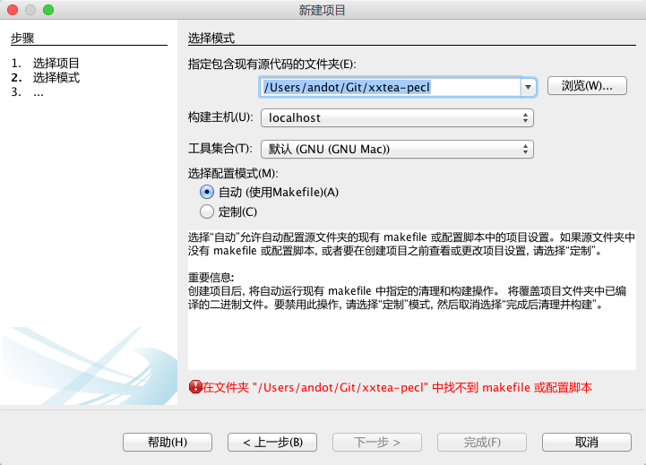

### 将扩展项目导入 Netbeans

下面，我们忽略上一节所讲的所有内容。接下来的内容是紧接上一节之前的内容的。

要编辑扩展中的每个文件，用 vi 当然没问题，但对我这个懒人来说，用 Netbeans 更顺手一些。所以这里介绍一下如何把下载的扩展源文件导入到 Netbeans 中去。

导入其实很简单，打开 Netbeans 的菜单，选择 [文件] > [新建项目]，然后选择类别为 C/C++，项目为基于现有源代码的 C/C++ 项目，如图所示：



然后点击浏览按钮，选择我们通过 git 下载的那个文件夹：



最后点完成就可以了。

如果你只是用 `git clone` 命令下载了那个项目，而没有执行：

```
phpize
```

或者执行了

```
phpize --clean
```

清除了生成的所有文件，那么你在刚才的界面里选择文件夹后，会看到这样的错误提示：



不用着急。重新执行一下 `phpize` 就可以了，然后在选择目录就可以了。
